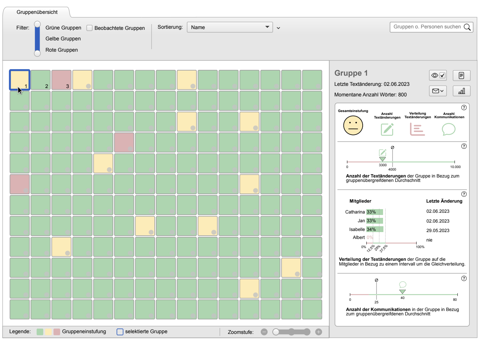

---

##### Download

+ [Thesis](thesis1.pdf)
<!--
+ [Online appendix](appendix1.pdf)
+ [Code and data](https://github.com/pmichaillat/feru) 
-->

---

##### Abstract

Teacher dashboards are a means of supporting teachers in the task of supervising and guiding collaborative work, which is essential for successful collaborative learning. Numerous dashboards are described in the literature, but few deal explicitly with collaborative writing, especially with regard to large courses with many groups. For this purpose, a dashboard is designed in the following design study. The main focus is on learner satisfaction with collaboration and its impact on participation, which is a prerequisite for interpersonal interactions that promote learning. After developing operationalisations for frustrating patterns of interaction that endanger participation, we will examine how indications of their presence can be visualised and clearly presented in the form of indicators and rules. Several candidate designs are then evaluated with teachers and finally a favoured design is implemented prototypically. This shows that teachers prefer a system that requires little configuration, even if this limits flexibility.

---

Teacher Dashboards sind ein Mittel, um Lehrende bei der für erfolgreiches gemeinsames Lernen essentiellen Aufga be zu unterstützen, kollaboratives Arbeiten zu beaufsichti gen und anzuleiten. Zahlreiche Dashboards werden in der Literatur beschrieben, doch nur wenige beschäftigen sich explizit mit dem kollaborativen Schreiben, besonders im Hinblick auf große Kurse mit vielen Gruppen. Für diesen Zweck wird in der folgenden Designstudie ein Dashboard entworfen. Dabei wird vor allem die Zufriedenheit der Lernenden mit der Zusammenarbeit und ihre Auswirkun gen auf die Partizipation, welche Voraussetzung für lern förderliche zwischenmenschliche Interaktionen ist, in den Blick genommen. Nach der Erarbeitung von Operationa lisierungen für frustrierende, die Partizipation gefährden de Interaktionsmuster wird untersucht, wie Hinweise auf deren Vorliegen in Form von Indikatoren und Regeln ver anschaulicht und übersichtlich dargestellt werden können. Mehrere Kandidatenentwürfe werden dann mit Lehrenden evaluiert und schließlich ein favorisierter Entwurf prototy penhaft implementiert. Dabei zeigt sich, dass Lehrende ein System mit geringem Konfigurationsaufwand bevorzugen, auch wenn dadurch die Flexibilität eingeschränkt wird.

---

##### Figure 2: Resulting design



---

##### Citation

J. Hofmann, "Teacher Dashboard für das Monitoring von Gruppen in kollaborativen Schreibprozessen," 2023.

```BibTeX
@misc{BA-Hofmann2023,
author = {Hofmann, Jan},
number = {September},
pages = {63},
school = {FernUniversit{\"{a}}t in Hagen},
title = {{Teacher Dashboard f{\"{u}}r das Monitoring von Gruppen in kollaborativen Schreibprozessen}},
type = {Bachelorarbeit},
year = {2023}
}
```

---
<!--
##### Related material

+ [Presentation slides](presentation1.pdf)
+ [Summary of the paper](https://www.penguinrandomhouse.com/books/110403/unusual-uses-for-olive-oil-by-alexander-mccall-smith/)
-->
