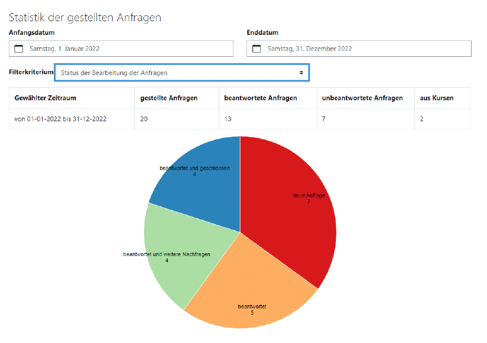

---

##### Download

+ [Thesis](thesis2.pdf)
<!--
+ [Online appendix](appendix2.pdf)
+ [Code and data](https://github.com/pmichaillat/wunk)
-->

---

##### Abstract

Collaborative learning offers the opportunity to improve learning and learn new concepts by working on tasks together. By working together, the different knowledge backgrounds and points of view of the participants are included in the solution process. Learners can learn with and from each other. They improve their communication skills and critically question different points of view. In order for the benefits of collaborative learning to materialize, potential conflicts and problems that may arise in the groups must be identified and resolved. With collaborative learning in an online environment, there are additional aspects that need to be considered, since there is a lack of direct personal contact and feedback from learners and teachers. This thesis analyzes how group-specific problems of collaborative learning can be identified and categorized with the help of a software solution. 
The aim of the thesis is the implementation and evaluation of a software that supports the learners and teachers in a learning management system LMS in identifying, categorizing and solving existing problems of collaborative learning and thus improves the learning process. With the help of the software, the learners ask the teachers questions, which are categorized according to the group-specific problems of collaborative learning known in the literature. In order to adequately classify possible conflict situations, the inquiries are transmitted with context information such as the group concerned, participants and activity of the course. Answering the inquiries is supported with a standardized answer catalog in the form of recommended answers and FAQ. In addition to the option of reporting problems in categorized form, the software also offers a dialogue function between learners and teachers for problem solving and the analysis of possible solutions. 
The solution was implemented as a plugin for the LMS Moodle and evaluated in a user study with learners and teachers in different use cases. In the user study, both the learners and the teachers could confirm that the fictitious, but realistically chosen problems of collaborative learning could be identified and categorized with the help of the plugin. Required changes to the software identified during the user study have been implemented.

---

Kollaboratives Lernen bietet die Möglichkeit, durch das gemeinschaftliche Bearbeiten von Aufgaben, das Lernen zu verbessern und neue Konzepte zu erlernen. Durch die gemeinsame Arbeit werden unterschiedliche Wissenshintergründe und Standpunkte der Teilnehmer*innen in den Lösungsprozess einbezogen. Die Lernenden können miteinander und voneinander lernen. Sie verbessern ihre kommu nikativen Fähigkeiten und hinterfragen unterschiedliche Standpunkte kritisch. Damit die Vorteile des kollaborativen Lernens zur Geltung kommen können, müssen mögliche Konflikte und Probleme, die sich in den Gruppen ergeben können, erkannt und behoben werden. Beim kollaborativen Lernen in ei ner Online-Umgebung kommen Aspekte hinzu, die zusätzlich bedacht werden müssen, da der direkte persönliche Kontakt zu und Feedback von den Lernenden und Lehrenden fehlen. Diese Abschluss arbeit analysiert, wie mit Hilfe einer Softwarelösung gruppenspezifische Probleme des kollaborativen Lernens identifiziert und kategorisiert werden können. 
Das Ziel der Abschlussarbeit ist die Implementierung und Evaluierung einer Software, die die Lernen den und Lehrenden in einem Lernmanagementsystem LMS bei der Identifizierung, Kategorisierung und Lösung bestehender Probleme des kollaborativen Lernens unterstützt und somit den Lernprozess verbessert. Mit Hilfe der Software stellen die Lernenden an die Lehrenden Anfragen, die nach der in der Literatur bekannten gruppenspezifischen Problemen des kollaborativen Lernens kategorisiert werden. Um mögliche Konfliktsituationen adäquat einzuordnen, werden die Anfragen mit Kontext informationen wie betreffende Gruppe, Teilnehmer*innen und Aktivität des Kurses übermittelt. Die Beantwortung der Anfragen wird mit einem standardisierten Antwortenkatalog in Form von empfoh lenen Antworten und FAQ unterstützt. Neben der Möglichkeit, Probleme kategorisiert zu melden, bietet die Software auch eine Dialogfunktion zwischen Lernenden und Lehrenden zur Problemlösung und der Analyse der Lösungswege an. 
Die Lösung wurde als Plugin für das LMS Moodle implementiert und in einer Nutzerstudie mit Lernenden und Lehrenden in unterschiedlichen Anwendungsfällen evaluiert. Es konnte in der Nutzer studie sowohl von den Lernenden als auch von den Lehrenden bestätigt werden, dass die fiktiven, jedoch realistisch gewählten Probleme des kollaborativen Lernens mit Hilfe des Plugins identifiziert und kategorisiert gemeldet werden konnten. Benötigte Änderungen der Software, die während der Nutzerstudie ermittelt wurden, wurden implementiert.

---

##### Figure 4.53: The statistical data is displayed as bar charts or pie charts



---

##### Citation

T. Brandenburger, "Identifizierung und Kategorisierung gruppenspezifischer Probleme des kollaborativen Lernens" 2023.

```BibTeX
@misc{MA-Hofmann2023,
author = {Brandenburger, Tobias},
number = {January},
pages = {133},
school = {FernUniversit{\"{a}}t in Hagen},
title = {{Identifizierung und Kategorisierung gruppenspezifischer Probleme des kollaborativen Lernens}},
type = {Masterarbeit},
year = {2023}
}
```

---
<!--
##### Related material

+ [Presentation slides](presentation2.pdf)
+ [Wikipedia entry](https://en.wikipedia.org/wiki/The_Finer_Points_of_Sausage_Dogs)
-->
