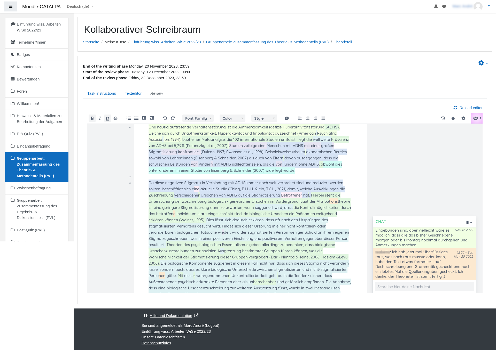

---

##### Download
<!--
+ [Paper](paper3.pdf)
+ [Presentation](presentation3.pdf)
+ [Code and data](https://github.com/pmichaillat/wunk)
-->

---

##### Abstract

Writing and collaboration are crucial skills in professional and academic settings. However, assessments of collaborative writing often focus only on the final text, overlooking individual contributions and the diverse strategies students employ during the writing process. To support teachers in interpreting and assessing student behaviour, we propose analysing writing data at a granular level, down to individual characters, and using user sessions as observation units to capture coherent interaction patterns. This paper introduces three methods for identifying interaction patterns in collaborative writing. The first method classifies session types by analysing features such as writing, reading, and communication behaviours, session length, and the number of group members collaborating synchronously. The second method identifies frequent sequences of session types by examining their order, enabling process analyses at an abstract yet manageable level compared to using log data. The third method focuses on text-level collaboration by evaluating the frequency of text passage modifications made by the original author or other group members. This approach quantifies individual collaboration and, at the group level, identifies isolated versus closely connected group members, shedding light on the mode of collaboration and degree of group cohesion. We demonstrate these three methods in a case study involving two cohorts, K_A=294 and K_B=242 groups of up to 9 learners (N_A=1,848, N_B=1,463). The interaction patterns identified using these methods are intended to help teachers understand collaborative writing processes and identify situations where the participating learners require support.

---

##### Figure 3: Screenshot of the collaborative writing space provided in Moodle LMS using the collaboarative writing (mod_cwr) plugin and *Etherpad lite*



---

##### Citation

Niels Seidel, Marc Burchart, Joerg M. Haake, Clara Schumacher, and Jakub Kuzilek. 2025. Detecting Interaction Patterns in Educational Collaborative Writing. In *Proceedings of CSCW’25*. ACM, New York, NY, USA, 25 pages. https://doi.org/yyyyyyyyyy

```BibTeX
@misc{MA-Hofmann2023,
author = {Brandenburger, Tobias},
number = {January},
pages = {133},
school = {FernUniversit{\"{a}}t in Hagen},
title = {{Identifizierung und Kategorisierung gruppenspezifischer Probleme des kollaborativen Lernens}},
type = {Masterarbeit},
year = {2023}
}
```

---
<!--
##### Related material

+ [Presentation slides](presentation2.pdf)
+ [Wikipedia entry](https://en.wikipedia.org/wiki/The_Finer_Points_of_Sausage_Dogs)
-->
